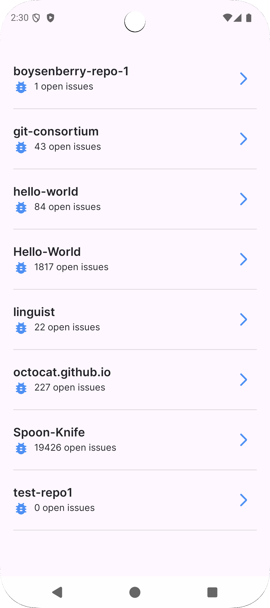
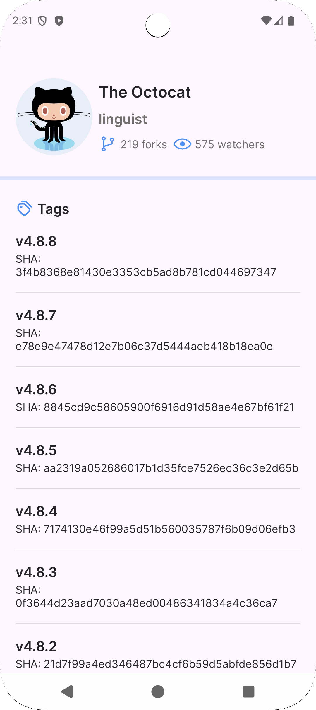
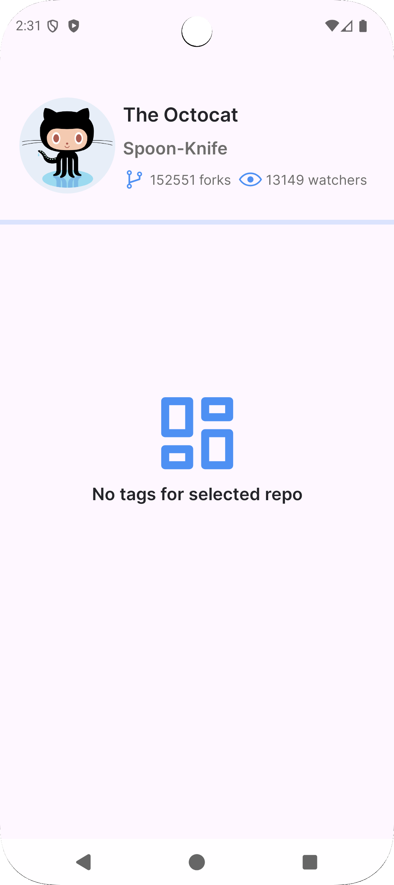

# Github Repos App

A simple Android app built using the **Single Activity** pattern and **MVVM** architecture to showcase user repositories and repository details from the Github API.

## Technologies and Architecture

- **MVVM architecture** for clear separation of layers (UI, business logic, data)  
- **Single Activity pattern** with Jetpack Navigation component  
- **Koin** for dependency injection and easy dependency management  
- **Retrofit** for REST API calls to the Github API  
- **Kotlin coroutines** for asynchronous network requests  
- UI built using **XML layouts**
- Supports **Dark theme**

## Screenshots

  
    &nbsp;&nbsp;&nbsp;
  
    &nbsp;&nbsp;&nbsp;
  

